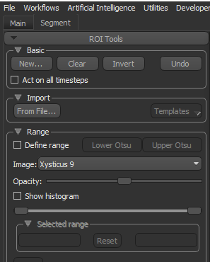
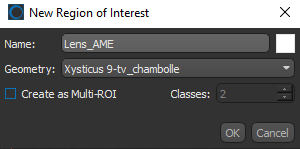
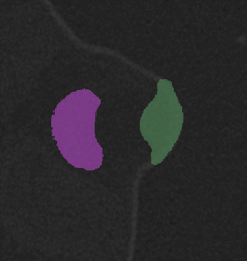
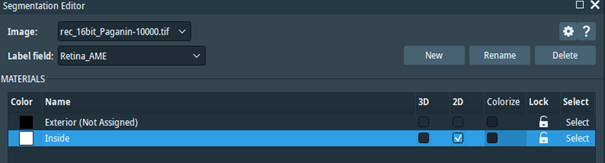
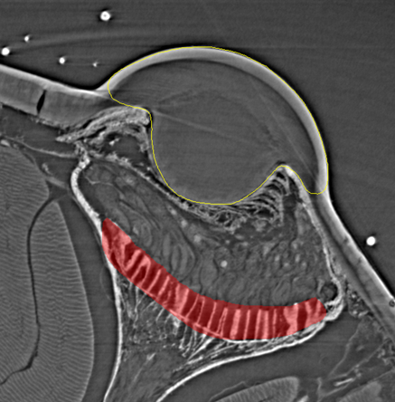
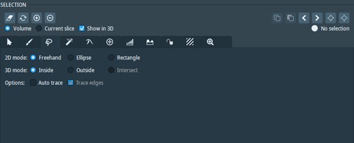

# Practical Guide for Segmentation and Export
## Dragonfly
1)	Create a separate ROI for each individual lens, retina, and cephalothorax marker. A new ROI can be created using the “segment” window on the left-hand side as seen in the figure below:

Under “Basic”, click “New….”, select the appropriate name and colour (either using the defaults or user specified colours stored under “params” in your ctSpyderFields folder) and click OK

 

2)	Segment each individual lens, retina, and cephalothorax marker as a separate ROI using the “ROI painter” tool, also located on the left-hand side window:
   

 

3)	After segmenting, right click on the ROI object (all ROIs are located in the right-hand side window under “Data Properties and Settings”) and go to “Export -> ROI as binary” and store as a .tiff stack in your desired output folder. Make sure to use the appropriate name for each component e.g., “Lens_AME”, “Retina_AME”, etc. The resulting stack can now be used in ctSpyderFields.

## Amira

1)	Load your desired .tiff stack/ amira project
2)	Go to the “Segmentation” window and create a separate label file for each individual lens, retina, and cephalothorax marker:

3)	If using “binary” option in ctSpyderFields for loading the elements, set the exterior to black and the material (“Inside”) to white, otherwise use the colours specified under “params” in your ctSpyderFields folder
4)	Segment using the desired tool:
   

The various segmentation tools are visible under “Selection” on the right side:

5)	After segmentation, export all the labels to the desired folder. To export a label, right click on the label, select “Export data as” and choose “2D TIF” as the data type, and an appropriate name e.g., “Lens_AME”, “Retina_AME” etc.
