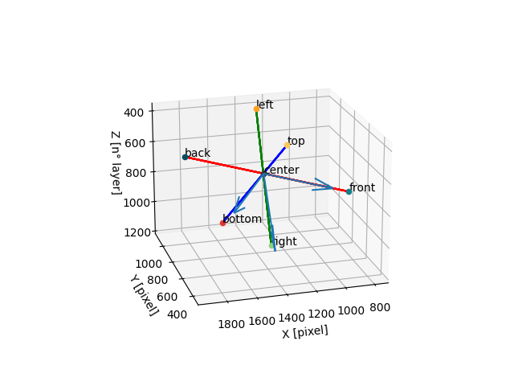
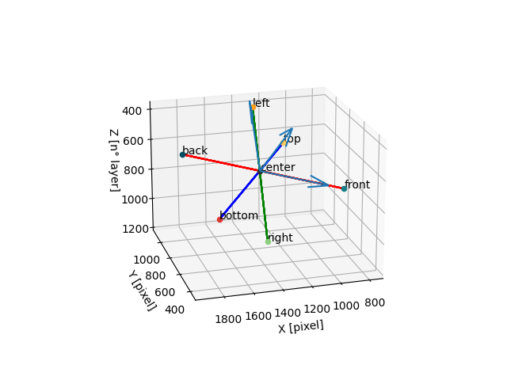
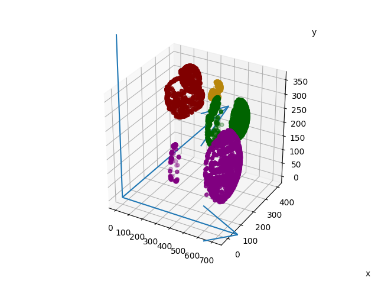
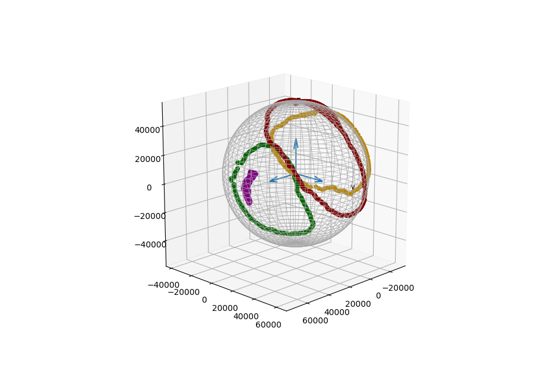
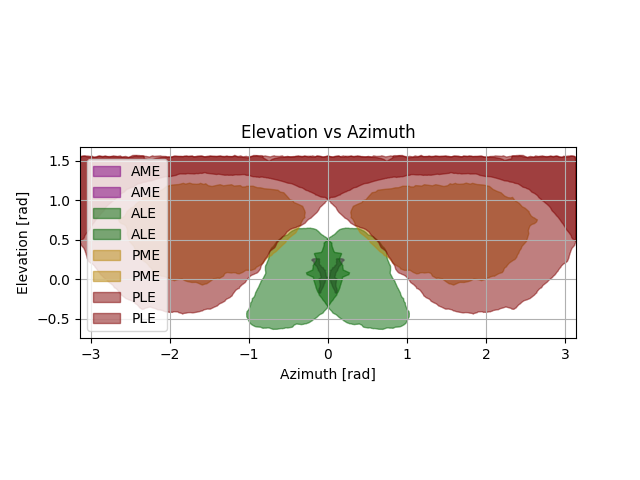
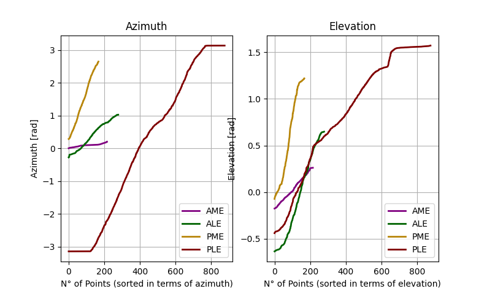
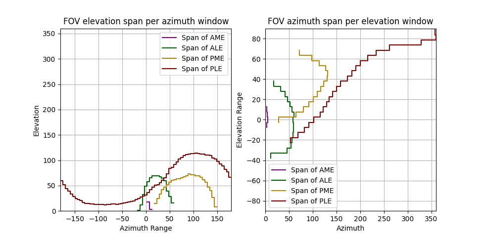

# Usage guide

This readme will guide you through the use the software from data (images coming from a segmented CT) to fields (plots and raw data export)

For a guide on how to install the software go to [README.md](https://github.com/massimodeagro/ctSpyderFields/blob/main/README.md), for how to prepare CT scans, go to [data_preparation.md](https://github.com/massimodeagro/ctSpyderFields/blob/main/docs/data_preparation.md)

We suggest using the package in interactive mode, looking at the output of every function and plotting on the go. A good way to do so is to use Jupyter notebooks. 

## Load packages
As a first step, let's load the library and other needed packages

```python
import ctSpyderFields as Ct
import numpy as np
```

## Definitions
Now, let's provide some definitions. These are specific to your machine and data

```python
path = '/path/to/foder/where/image/data/is/located/' #remember the final "/"
color_paramspath = 'path/to/where/parameters/for/images/is/located/color_params.yaml'
name_paramspath = 'path/to/where/parameters/for/images/is/located/name_params.yaml'
```
path points to where your tiff-stack is located. Check  [data_preparation.md](https://github.com/massimodeagro/ctSpyderFields/blob/main/docs/data_preparation.md) for more instructions.

`color_params.yaml` contains the color definition for importing points from image stack from AMIRA/DRAGONFLY. This is needed only if the image stack presents different ROIs with different colors (as per the guide reports in AMIRA, for example). Provide in the yaml the RGB value for each ROIs, giving a minimum and a maximum value (images may not be precise and especially around the edges may blur slightly with the background). An example params.yaml is provided in the data folder

`name_params.yaml` provides the name of the image stack associated with each ROI. Change them accordingly to your image naming (e.g., instead of 'Lens_AME' write 'Image_name_without_incremental_number_nor_file_type'). If the same image stack contains more than one ROI in different colors, provide the same text (e.g. AME: Lens: 'Full_AME_image_name', Retina: 'Full_AME_image_name')

## Import image stacks
First, we create the object

```python
MySpiderObjectName = Ct.Spider(workdir=path, voxelsize=0.001, name_paramspath=name_paramspath, color_paramspath=color_paramspath,
                               available_eyes = ["AME", "ALE", "PME", "PLE"],
                               eyes_toplot_colors = {'AME': 'purple', 'ALE': 'darkgreen', 'PME': 'darkgoldenrod', 'PLE': 'maroon'}) 
# remember to set voxelsize as given by your CT analysis software
```

Then, we load the images.

If you are using an image stack where ROIs have different colors, or in general the images are RGB, use

```python
MySpiderObjectName.load_all_labels_split(style='color')
MySpiderObjectName.find_eyes_points(style='color')
MySpiderObjectName.compute_cephalothorax(style='color')
```

If you are using an image stack where ROIs are all in different stacks, are white and the baground is black (0s and 1s), use

```python
MySpiderObjectName.load_all_labels_split(style='binary')
MySpiderObjectName.find_eyes_points(style='binary')
MySpiderObjectName.find_cephalothorax_points(style='binary')
```

## Save and Reload
Loading images is time consuming. If you want, you can at this stage save your data in pickle file. Next time you can start from the point data directly, using a lot less memory and taking less time
```python
MySpiderObjectName.save(filename='GenusSpecies')
#MySpiderObjectName.save('GenusSpecies', type='h5') # Alternatively, specify the file extension. the default is .pickle
```

from now on, reload the data with
```python
MySpiderObjectName = Ct.Spider(workdir=path, voxelsize=0.001, paramspath=paramspath) 
# REMEMBER! You always have to recreate the spider object for every new file.
MySpiderObjectName.load(filename='GenusSpecies', type='pickle')
```

Note that saving only save dot clouds. For the projection data you will have to compute it every time.

## Anatomy and orientation
Now, we need to go from the provided ROIs to anatomically meaningful solids. Specifically we need to define:

- The spider orientation relative to the CT scanner
- The eyes and retina surfaces
- The eyes focal point
- Let's start with spider orientation

### Orientation
```python
MySpiderObjectName.head_SoR(flipX=False, flipZ=False, plot=False)
```

This code takes the 7 body markers and create a new set of axis. This is:

- centered on the center marker
- with its x axis aligned with the back-front like, with positive xs going towards front
- with its z axis perpendicular to x, parallel to the top-bottom axis with positive zs towards top
- with its y axis perpendicular to x and z
- Note that this function has a plot argument. This is used to check for errors in this reorientation step. Try:

```python
MySpiderObjectName.head_SoR(flipX=False, flipZ=False, plot=True)
```



If from the plot you notice some errors, you can fix it with the other two arguments. For example, if the Z axis points towards bottom rather than top, do:

```python
MySpiderObjectName.head_SoR(flipX=False, flipZ=True, plot=True)
```



Remember. This code saves the roto-translational matrix for the spider every time you run it. Be sure that your last run had the correct orientation.

### Anatomy
Now, let's use the point clouds to extract relevant information for eyes and retinas.

```python
MySpiderObjectName.compute_eyes()
```

The function has 2 facultative arguments, "focal_point_type" and "focal_point_position". These are used in finding the focal point of the lens, from which the retinal points will be projected in order to find the visual field.

By default, focal_point_type='sphere'. This means that a sphere will be fit on the lens surface, and its center will be used as the focal point. It can happen that the lens is very flat, or maybe the point cloud is of bad quality. This can cause the sphere fitting algorithm to fail, and generate over or undersized sphere with centers behind the retina. You can notice this happening if when projecting the FOV they appear flipped or otherwise unrealistic (we will see this in the next step).

If this happens, you can use focal_point_type='given'. In this case, the focal point will be defined as a point along the lens main axis, equidistant between the top surface of the lens and the bottom surface of the retina. You can manually shift this point more towards the lens or the retina by changing focal_point_position value. here, 0 = in contact with the retinal surface, 1 = in contact with the lens surface, 0.5 = midway between the two, all other values beween 0 and 1 = proportional positioning.

Let's try with an example

```python
MySpiderObjectName.compute_eyes(focal_point_type='given', focal_point_position=0.75)
```

### Rotate
Now that we have both the points and the rototranslational matrix, we can reorient all we have in order to have the spider as the center of our reference frame.

```python
MySpiderObjectName.from_std_to_head()
```

here you can again save your progress

```python
MySpiderObjectName.save(filename='GenusSpecies')
```

Remember to recreate the object and reload if you want to restart from here

Let's take a moment to check our progress.

```python
MySpiderObjectName.plot_matplotlib(elements=("lens", "retina"), plot_FOV_sphere=False, field_mm=5)
```



the field_mm argument controls some things that will come in use later. For now, it is used to determine the length of X, Y, and Z axis on the plot. Specifically, the axis are (long field_mm/2)*voxelsize. We set plot_FOV_sphere as false as for now we have not created the field of views, so it would plot only an empty sphere.

Use this plot to check how lens and retina look! As well as if the orientation is correct. Note that the plot does not show all of the points, but only the ones on the surface (i.e. the convex hull)

If something doesn't look right, go back to the previous steps!

## Retinal projection

Now, we can finally use the data we collected to project the retina surface through the lens focal point and therefore get the visual fields.

First, we project the retina towards the lens center, and hit a imaginary sphere around the spider

```python
MySpiderObjectName.project_retinas_full(field_mm=150)
```

150mm is the default. This doesn't really matter exclusion made for the sake of visualization

You can now look at the projection with `GenusSpecies.plot_matplotlib(elements=("projection_full"))`, but we advise against. Plotting all of these points will bloat the processors and is anyway 
not very useful. Instead, we will use the following function to extract the contours of the visual field, much more usable

```python
MySpiderObjectName.find_all_fields_contours_alphashape([90, 20, 20, 20])
```

The code works using [alpha shapes](https://en.wikipedia.org/wiki/Alpha_shape). The argument of the function is the provided alpha. If you go too small, the shape will follow the FOV only roughly. If you go too high, you will not get a single closed shape. Start with high numbers and try. If the system throws an error, change and retry.

In order to not recalculate successful alphashape computation, you can specify it in the function

```python
MySpiderObjectName.find_all_fields_contours_alphashape([90, 20, 20, 20], 
                                                       overwrite=[False, True, True, True], #this will skip the first eye if already exists
                                                       polygons=[1,1,1,1]) #here you can specify whether the field of view is split in 2. It can happen if it goes across the 180° point 
```

Now you can have a look!

```python
MySpiderObjectName.plot_matplotlib(elements=("FOVoutline"))
```


If you want to compare the full projection with the developed contours, 
do `MySpiderObjectName.plot_matplotlib(elements=("projection_full", "FOVoutline"))` It may look a bit messy though. 
We suggest to keep on only the outline.

Now that we have the FOV contour, we can calculate the spans for the final analysis.

```python
MySpiderObjectName.sphericalCoordinates_calculateSpan() #this calculates the angular spans for each eye. it requires discretization. argument is "spans", default is 72
MySpiderObjectName.binocularOverlap_compute() # to calculate the binocular overlap, mirroring each eye and seeing if they have an overlap area
MySpiderObjectName.multiEyeOverlap_compute() # to calculate pairwise eye overlap.
MySpiderObjectName.fullSphereOverlap_compute() # to calculate how much of the full sphere each eye overlaps
```

Now we can have a look at the results!

```python
MySpiderObjectName.sphericalCoordinates_plotFields()
```


```python
MySpiderObjectName.sphericalCoordinates_plotSorted()
```


These plots show the spherical coordinates.


```python
MySpiderObjectName.sphericalCoordinates_plotSpans()
```




These instead show the calculated spans! The analysis is finished! If you want to extract the data for future use, you can do:

```python
MySpiderObjectName.sphericalCoordinates_save(filename='GenusSpecies')
```

All the files are saved in the folder specified upon object creation (workdir). 

you can also save a report of the overlaps

```python
MySpiderObjectName.overlapsReport_save(filename='GenusSpecies')
```


## Custom plotting

remember that you can always extract the data from the Spider object to make custom plots, without having to use the
pre-packaged functions. See here an example using plotly that shows both sides by mirroring the data

```python
import plotly.graph_objects as go

#first, draw a sphere
u, v = np.mgrid[0:2 * np.pi:50j, 0:np.pi:50j]

x = 150/0.003 * np.cos(u) * np.sin(v)
y = 150/0.003 * np.sin(u) * np.sin(v)
z = 150/0.003 * np.cos(v)

sphere = go.Surface(x=x, y=y, z=z, opacity=0.7,colorscale=[[0, 'white'], [1,'white']],
             showscale=False)

data = []
data.append(sphere)
for eye, color in zip(['AME', 'ALE', 'PME', 'PLE'], ['purple', 'green', 'goldenrod', 'darkred']): #for all eyes
    Outline = MySpiderObjectName.eyes[eye].FOVcontourPoints #extract points
    data.append(
        go.Scatter3d(x=Outline[:,0], y=Outline[:,1], z=Outline[:,2],
                         mode='markers', marker={'color': color, 'size': 3}) #plot straight
    )
    data.append(
        go.Scatter3d(x=Outline[:,0], y=np.multiply(Outline[:,1], -1), z=Outline[:,2],
                        mode='markers', marker={'color': color, 'size': 3}) #plot reversed
    )

fig = go.Figure(data=data)
fig.show()
```


